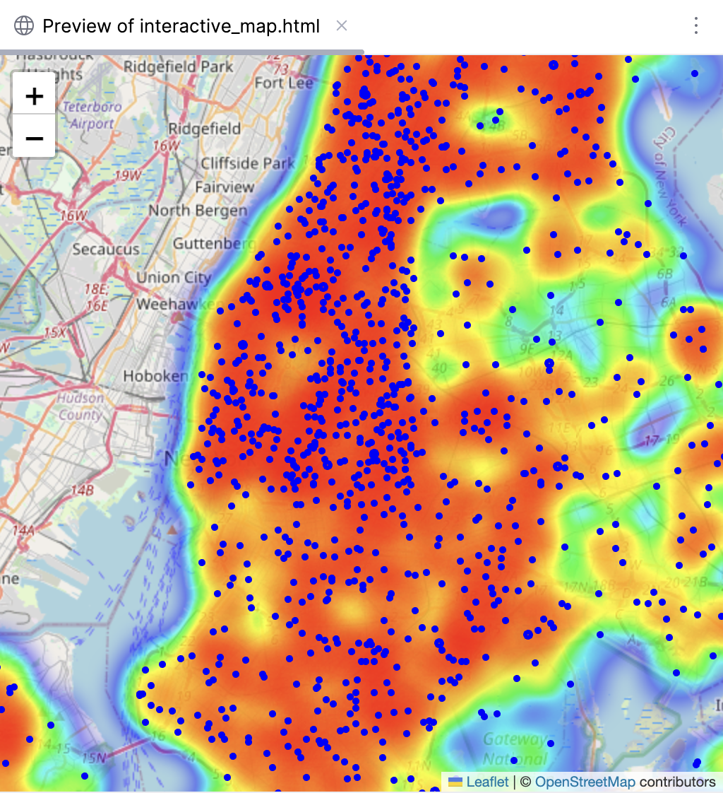
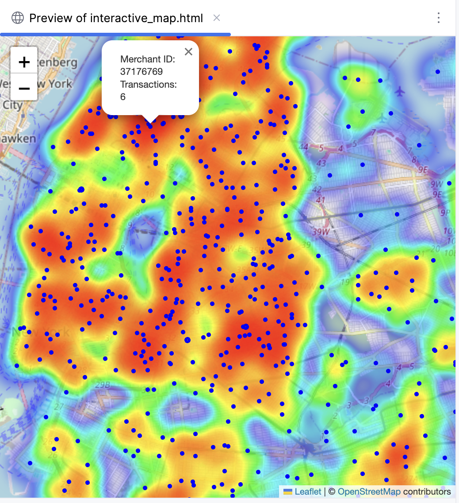
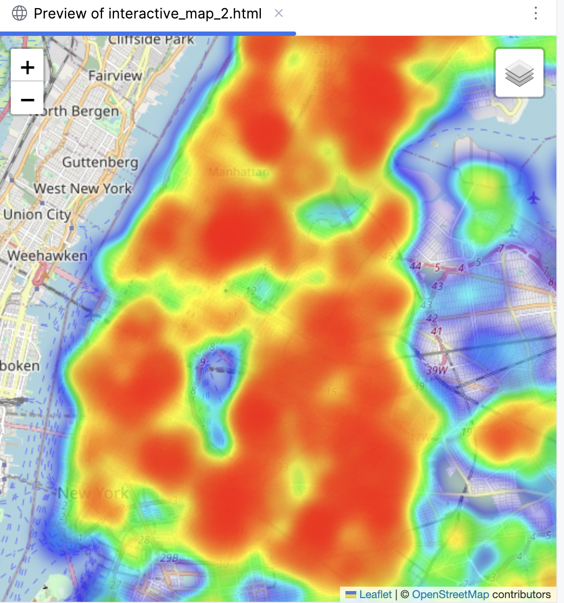
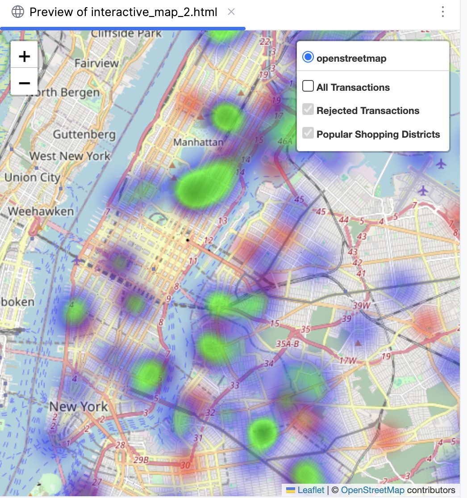
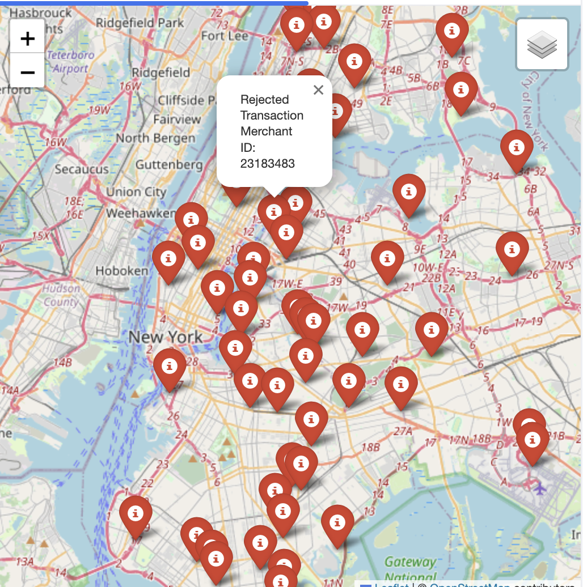
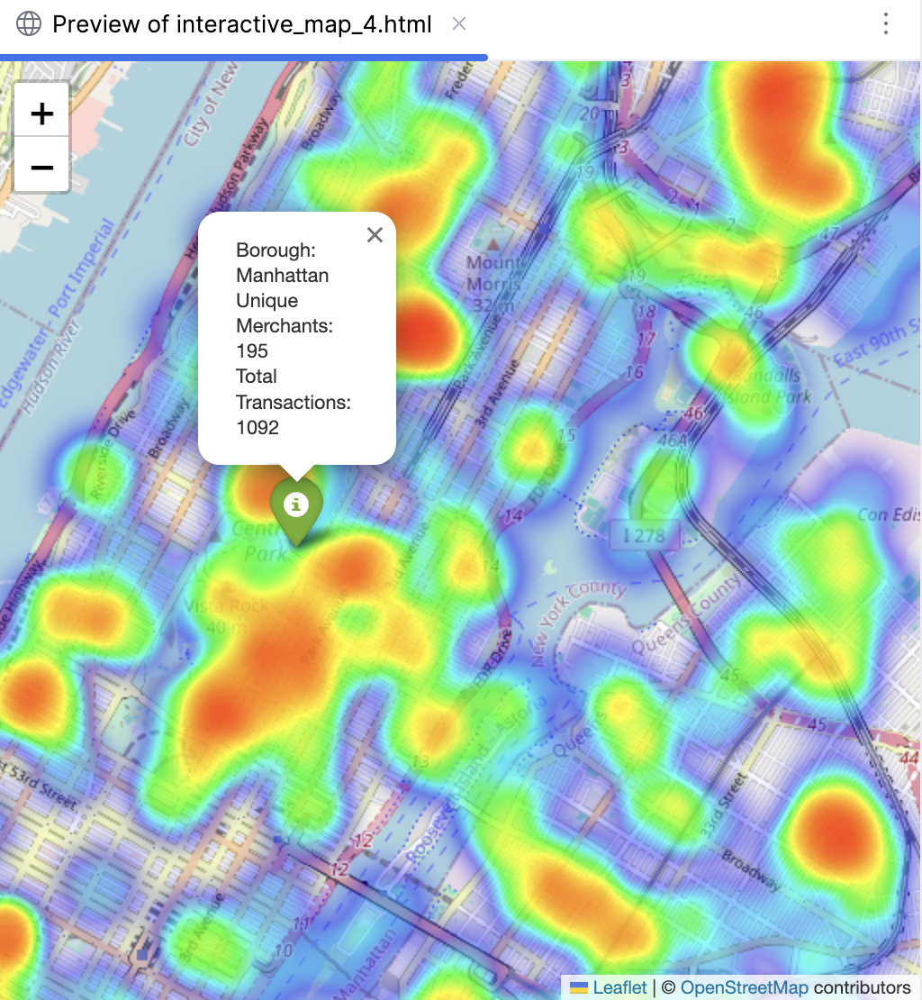
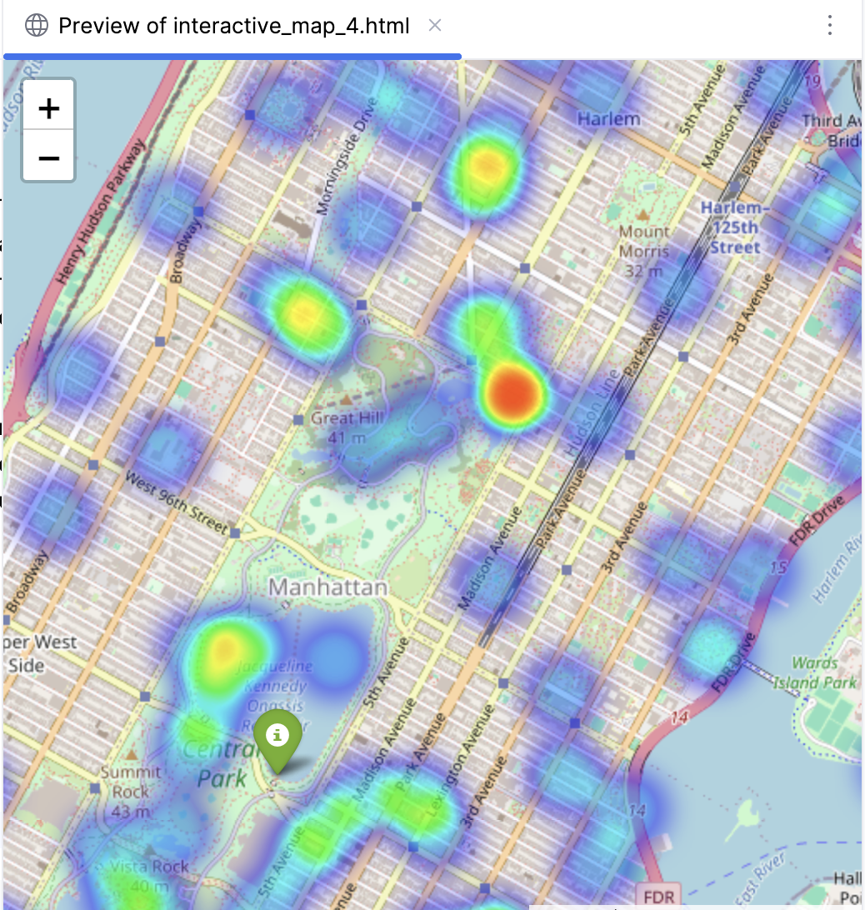

# Script No.3 , COP6481,SP'24, Team 06

## GIS MAPPING for Credit Card Transactions

### Assignment

* Data preprocessing
* Geospacial Analysis
* Visualization
* Spacial Analysis
* Insights and Interpretation

### Running the App

Run main.py. main.py will call spacial_analysis.py and then call
map_visualization.py.
map_visualization.py also calls interactive_map.py, interactive_map_2.py,
interactive_map_3.py, interactive_map_4.py.
map_visualization.py will generate a plot.
While the plot is displayed, the interactive_map scripes will generate
interactive_map.html, interactive_map_2.html, interactive_map_3.html,
interactive_map_4.html. These are interactive maps, just open in a broweser to
view and interact with.
When the html file are done being generated, the program will type "Done" on the console. 

### The Data Set

The dataset was generated in projects generate_data.py python file.
The output file that is generated is called:
cc_transactions.csv

In total 2000 records were generated.
There were 500 unique merchants
There were 1800 unique persons

These are the columns for each transaction:

*Transaction ID*

Random Number

*Date*

Month of August 2023

*Amount*

Random number

*Latitude,Longitude*,

Generated by borough according to following ratios:

'Manhattan': 0.35,
'Brooklyn': 0.20,
'Queens': 0.20,
'Bronx': 0.15,
'Staten Island': 0.10,

*User ID,*

Random Number

*Status,*

Acceped or declined.
5% declined

*Merchant ID*

Random number

### Mapping Data

We used nyc_boroughs.geojson

This came from the NYC OpenData website at:
https://data.cityofnewyork.us/City-Government/Borough-Boundaries/tqmj-j8zm

We performed the spacial joins with this data set and the generated data.

This our first visualization in Figure 0., which is the plot generated by
the map_visualizatuion.py python script.

Figure 0.

To generate this plot we used the output from

the spacial_analysis.py script, which is not to be confused with the
spacial analysis section in the assignment, and that is covered in the next section.

#### spacial_analysis

The perform_spatial_join function integrates credit card transactions with New York City geographic borough boundaries.
It reads

* transactions from a CSV file and
* borough outlines from a GeoJSON file,

converts them to a unified WGS 84 coordinate system, and merges them based on location.
Each transaction is tagged with the borough it falls within, adding a `boro_name` column to the data.
Transactions that don't match a borough are removed.

#### map_visualization

The plot_transactions function visualizes credit card transactions on a map,
with each transaction's frequency at merchant locations aggregated and represented by varying marker sizes.
The transactions are color-coded by boroughs for clear visual segmentation.
This function takes a GeoDataFrame with spatially joined transaction and borough data,
computes the number of transactions for each merchant,
and then plots them on an NYC map base layer using a predefined color scheme for each borough.
The result is a static map that displays transaction density and distribution across the boroughs.

#### plot_interactive_map

The first of the series of interactive maps is plot_interactive_map.
This function creates an interactive map using Folium.
Folium is a Python library for visualizing geospatial data.
The function uses the aggregated  Merchant ID data to count transactions per merchant.
Folium generates a map centered on the average latitude and longitude of the transactions,
adding a heat map layer to visualize transaction density, and placeing interactive markers for each merchant.
By hovering over a merchant, a transaction count pop ups with interactive  merchant details.
The interactive map is stored in an HTML file, interactive_map.html ,which included in the project.
interactive_map.html can be viewed in a web browser.
Some static images of the interactive map are included below in figures 1 and 2.

###### Figure 1.

In the first image, above we see the heat map and can zoom in/out.

###### Figure 2

In the second image, above we see the heat map zoomed in anf when we hover over.
one of the merchant dots we see the merchant id and how many transactions they had during the period

### Spacial Analysis

In this section we look at two characteristics of the data:

* concentration of merchants
* concentration of declined transactions

The former could be an indicator of shopping districts and the latter area where potentail fraud may be
prevalent, requiring extra vigilance on the part of the credit card company.

#### interactive_map_2

The plot_interactive_map_2 function creates a interactive map to visualize credit card transaction data.
The function establishes a base map centered on the mean latitude and longitude of the dataset.
It incorporates a heatmap layer to depict all transactions, providing a  representation of transaction density.
A separate,  color gradient to signify varying levels of transaction rejection, heatmap for rejected transactions
represents potentially high-risk zones,
Another layer uses transaction counts to visualizes popular shopping districts and also uses  a
color gradient to indicate areas of high commercial activity.
The function enhances user interaction through a layer control feature, enabling the toggling between heatmap views. Finally, the map is saved as an HTML file, making it accessible for viewing and analysis, thereby providing valuable insights into transaction patterns, high-risk areas, and consumer behavior in shopping districts.

In Figure 3. we see all the transactions,
In Figure 4, we only see the clusters of high levels of
merchant activity (green) and high levels of rejected transactions (red).

###### Figure 3

###### Figure 4

#### interactive_map_3

The code for interactive_map_3 generates an interactive map visualizing
credit card transactions as a heatmap and marks
rejected transactions with red icons.
This is depicted in Figure 5 as rejected transactions over a heat map
and in Figure 6 as rejected transaction with a
hover pop up and the heat map turned off.

###### Figure 5

###### Figure 6

#### interactive_map_4

The plot_interactive_map_4 function calls on the Folium library to
create an interactive map illustrating credit card transaction activity.
A heatmap layer is then added to visualize the density of
transactions across the New York City, using latitude, longitude,
and transaction count data.
Transaction data is also aggregated by borough,
calculating the number of unique merchants and total transactions,
along with the mean coordinates for each borough to represent its center.
A marker is placed at  central coordinates for each borough,
and a popup provides details such as borough name, count of unique merchants, and total transactions.

In Figure 7 we have a markers centered in each borough with an interactive popup.
In Figure 8, as the heat map thins out, we can see the street map.
The Blue areas represent regions with a lower concentration of transactions.
In heatmaps, cooler colors like blue typically denote lower values,
so these areas might have fewer transactions compared to the rest of the map.
The blue areas with green in the middle represent a higher concentration of transactions.
Green is  used to indicate a medium level of intensity on the heatmap,
implying a moderate number of transactions in those areas.
Blue areas with green in the middle and red in the middle of the green in a heatmap
represents the highest intensity or the highest concentration of data points—in this case,
the highest number of transactions.
The red center, surrounded by green and then blue, indicates that there is a
hotspot of transaction activity in that specific area,
with the most intense activity being right at the red center,
decreasing outward to green and then blue areas.

###### Figure 7

###### Figure 8

### Insights and Interpretation

For this project we excercised the option to work off simulated data. This served several purposes including
ramping up quickly by not having to search for data, creating the data just as we wanted,
and having less to work regarding inssuring there were no outliers, missing values, and so on.
This allowed for more time to work on the visualization.
The secondary benefit is that should we need to operate on real credit card data, we have working code that we can
modify to quickly ramp up for GIS visualization.

Since we used random numbers we cant actually identify real world trends, but were able to generate maps that
showed were potential shopping and high risk areas existed. We could then run our programs againts real data,
mush faster becasue we already have a working system.

Once again, with synthetic data that is evenly distriubuted,
consumer behavior, spending habits, and economic activities would be completely random but we could utlize the
code we have as starting point to make these evaluations. For example, our synthetic data generate dates between
August first and August 31, 2023. If we were to segment the processing of data over time, we could create
an animation that could track spending habits over the course of the year.
